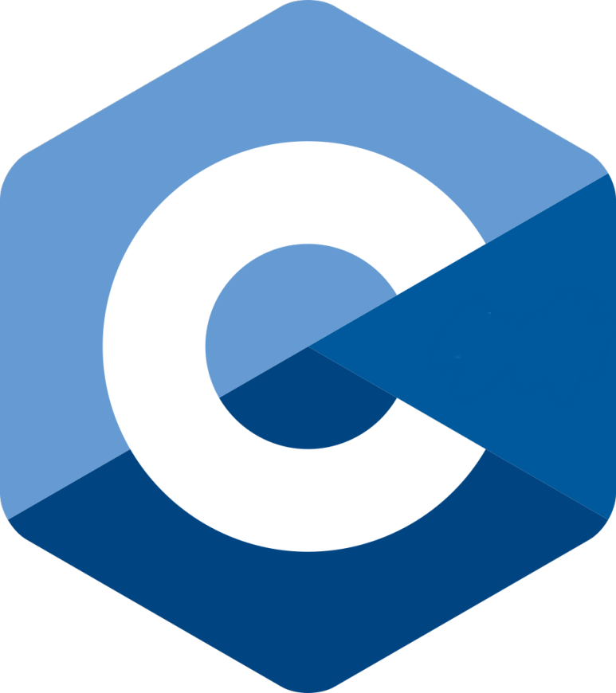
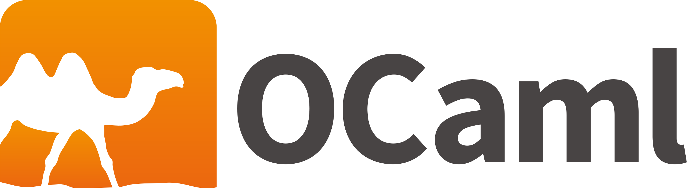
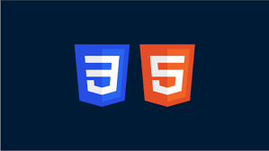

### Hi there 👋
Hello, I am a Computer Science student. I have a strong interest in game development. I also like literature, traveling, and new experiences.

I am studying Computer Science and Game Engineering at the University of Paris 8 Vincennes-Saint-Denis.

Tools

  
  
  
  
  
  
  
  
  
  
  
   

